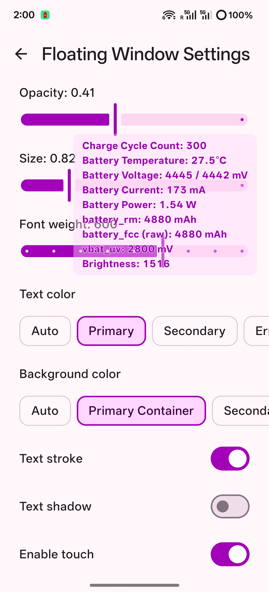
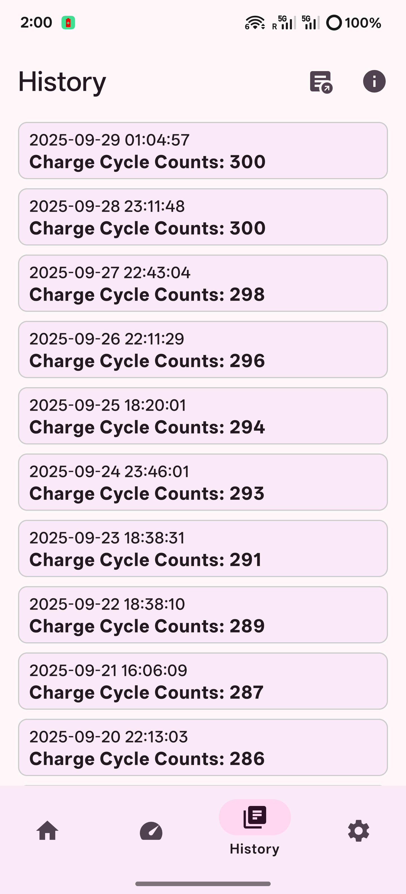

# PlusPlusBattery - Battery Info Viewer for OPlus Devices

[简体中文](./README.zh.md) | English

## Introduction

`PlusPlusBattery` is a lightweight battery info and health estimation tool specifically tailored for OnePlus/Oppo/Realme devices (with universal device support). It provides real-time monitoring of battery status and can evaluate the Full Charge Capacity (FCC) and the uncompensated raw FCC and State of Health (SOH) of silicon-carbon anode batteries under specific conditions.

## Features

- **Real-time Battery Info**: Displays current battery level, voltage, current, charge/discharge power with charts, and health status without root access.
- **Battery Health Estimation**: Calculates and records Full Charge Capacity only when the battery level is 100% and the battery current is within the range from 0 to 20 mA. This is used to estimate battery health and lifespan. Not a true value, just an estimation.
- **Cycle Count History**: Records the daily cycle count automatically or manually, and saves it locally using a Room database. Users can view it on the history page, and export it to csv files.
- **Real-Time Battery Monitor**: Show battery metrics in a customizable floating window or the notification area. Info entries can be customized.
- **Root Mode**: Requires root permission to read additional information.
- **Current Remaining Capacity (Root Mode)**: Read from `/sys/class/oplus_chg/battery/battery_rm`. This value changes with battery level.
- **Full Charge Capacity (battery_fcc) (Root Mode)**: Read from `/sys/class/oplus_chg/battery/battery_fcc`. This value fluctuates based on charging/discharging behavior.
- **Raw Full Charge Capacity (Root Mode)**: Reverse-calculated uncompensated FCC. Silicon-carbon anode batteries typically apply algorithmic compensation based on undervoltage thresholds.
- **Battery Health (battery_soh) (Root Mode)**: Read from `/sys/class/oplus_chg/battery/battery_soh`. This value fluctuates with usage.
- **Raw Battery Health (Root Mode)**: Reverse-calculated uncompensated SOH. Compensation is usually applied in silicon-carbon batteries based on undervoltage thresholds.
- **Battery Under-voltage Threshold (vbat_uv) (Root Mode)**: Read from `/sys/class/oplus_chg/battery/vbat_uv`. The device will shut down if the voltage drops below this threshold.
- **Battery Serial Number (battery_sn) (Root Mode)**: Read from `/sys/class/oplus_chg/battery/battery_sn`.
- **Battery Manufacture Date (battery_manu_date) (Root Mode)**: Read from `/sys/class/oplus_chg/battery/battery_manu_date`.
- **Qmax (batt_qmax) (Root Mode)**: Qmax refers to the chemical capacity of the battery. The value of this capacity is load independent. This is the capacity that can be released by a battery under very low load current, usually expressed in mAh. In the system, this value changes triggered by some conditions.
- **Custom Entries (Root Mode)**: Customizable entries for universal devices, with default presets displaying charge cycles & fccs from generic linux power_supply files. You can also add any other readable path as you like. Users can also export/import custom profiles.

## Experimental Features
- **Get Battery Data from Logcat (Root Mode)**: For some devices, this app can extract battery related data from logcat. Currently supported devices include some OPlus, Moto and Xiaomi devices (limited support varies on models and systems)

## Screenshots

  
  
  
  
  

## Downloads

Or download the APK from [Github Release](https://github.com/dijia1124/PlusPlusBattery/releases)

## Installation

1. Ensure your OnePlus device is running a recent version of ColorOS or OxygenOS (e.g., ColorOS 15), or a relatively new AOSP-based ROM.
2. Go to the Release page to download and install the APK.
3. Launch the app.
4. (Optional) Grant root access.
5. (Optional) For battery monitor notification: battery optimization in system settings for PlusPlusBattery needs to be off. Additionally, for ColorOS 15 users, enabling "Auto-launch" permission in system settings for PlusPlusBattery is also needed to make the monitor service resume/pause depending on screen-on/off properly.
6. (Optional) For non-Oppo/OnePlus/Realme devices, you may want to disable the option 'Show OPlus exclusive entries' to hide those useless data under root mode, and edit the custom entries to suit your needs.

## Credits

Special thanks to [@shminer](https://github.com/shminer) for providing kernel source code, algorithm logic, and insights related to FCC & SOH compensation.

## Contributors

## License

This project is licensed under the MIT License. Please refer to the `LICENSE` file for details.